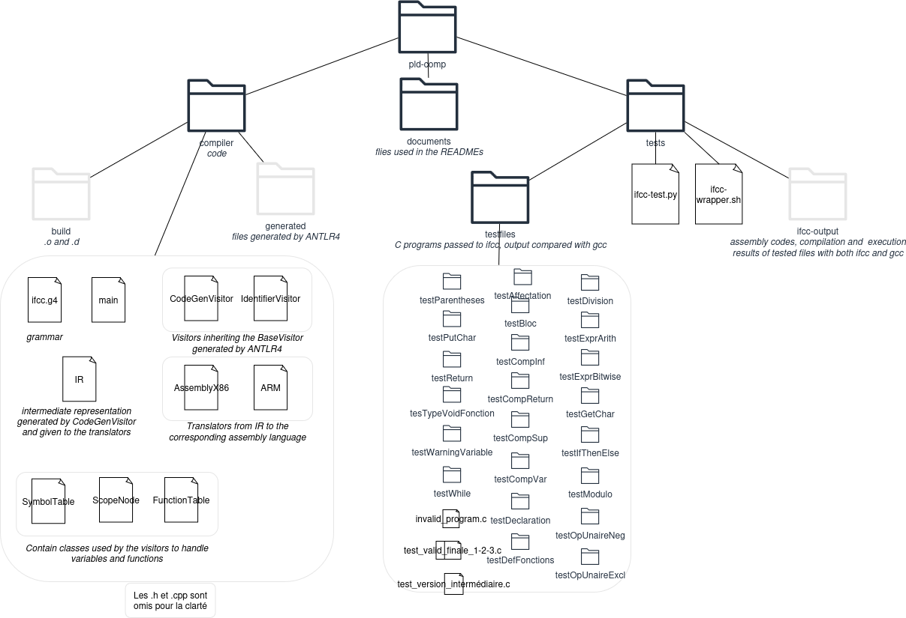
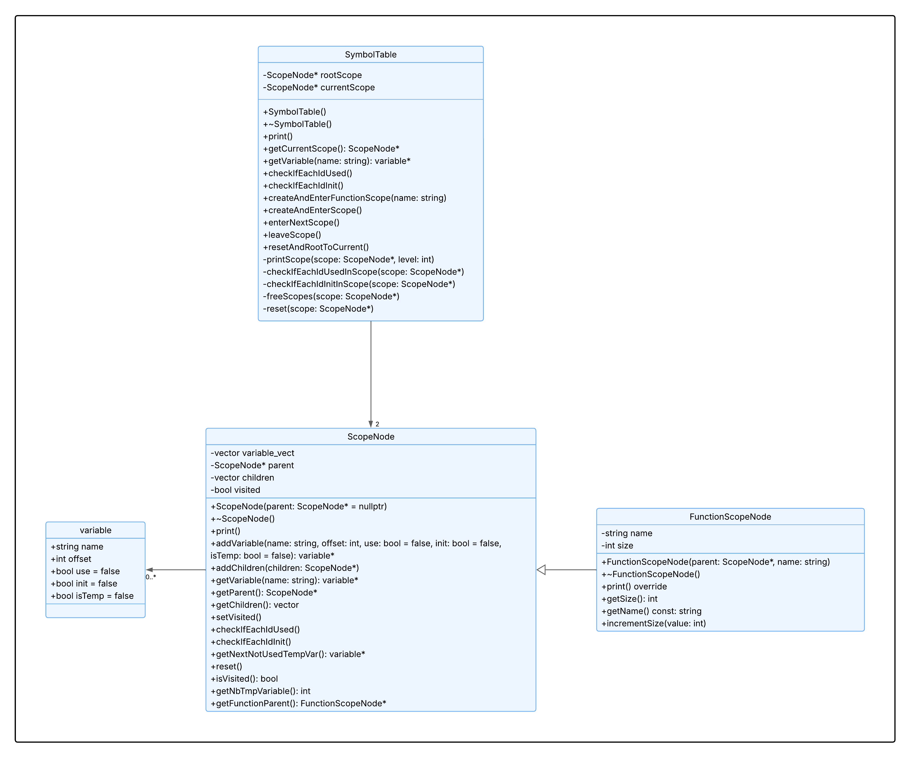

<h1 align="center">C - Projet Compilation</h1>

[![C language logo][c-logo]](https://en.cppreference.com/w/c/language)

<!-- TABLE OF CONTENTS -->

  
Table des matières

  <ol>
    <li>
      <a href="#gestion-des-différents-scopes">Gestion des différents scopes</a>
      <ul>
        <li><a href="#table-de-symboles">Table de symboles</a></li>
        <li><a href="#scopenode-et-functionscopenode">ScopeNode et FunctionScopeNode</a></li>
        <li><a href="#navigation-entre-les-scopes">Navigation entre les scopes</a></li>
        <li><a href="#utilisation">Utilisation</a></li>
      </ul>
    </li>
    <li>
      <a href="#intermediate-representation-ir">Intermediate Representation</a>
      <ul>
        <li><a href="#structure">Structure</a></li>
        <li><a href="#utilisation">Utilisation</a></li>
      </ul>
    </li>
    <li>
      <a href="#table-de-fonctions">Table de fonctions</a>
      <ul>
        <li><a href="#structure">Structure</a></li>
        <li><a href="#utilisation">Utilisation</a></li>
      </ul>
    </li>
  </ol>

## Introduction et contribution

Comme décrit dans le README_User, ce projet est un compilateur d'une sous-partie du langage C, écrit en C++ et utilisant ANTLR4. Il est distribué sous la licence MIT.

Ce projet a été réalisé dans le cadre d'un projet de cours de l'INSA Lyon et n'est pas maintenu. Libre à toutes et à tous de reprendre le projet dans le respect de la licence MIT. 

## Structure globale

Le dossier `compiler` contient le code et le dossier `test` contient les tests.

L'outil ANTLR4 utilise la grammaire décrite dans le fichier ifcc.g4 pour générer l'arbre abstrait syntaxique, ou plutôt un visiteur de base qui visite cet arbre, qui se trouve dans le dossier `generated`.
Il est ensuite possible de créer des visiteurs héritant du visiteur de base. Nous avons trois visiteurs : IdentifierVisitor et CodeGenVisitor.

**IdentifierVisitor :** 
Ce premier visiteur va principalement créer les variables dans la table des symboles et les fonctions dans la table des fonctions. Le visiteur effectue des vérifications sur les déclarations, définitions et retours des variables et fonctions. Il déclenche des erreurs et des warnings. Plus de détails sont donnés plus bas.
 
**CodeGenVisitor :**
Comme son nom l'indique, le rôle de ce visiteur est de déclencher la traduction en assembleur des instructions. Il peut également déclencher des erreurs, comme sur le nombre d'arguments des fonctions. 

## Gestion des différents scopes

### Table de symboles

Notre table des symboles permet de gérer les variables du programme compilé, que ce soit les variables temporaires que nous créons lors de la visite du programme ou les variables déclarées dans le programme lui-même. Cette table de symboles est déclarée dans le fichier [SymbolTable.h](compiler/SymbolTable.h) et implémentée dans le fichier [SymbolTable.cpp](compiler/SymbolTable.cpp).

Ces variables sont représentées via la structure "variable" qui possède les attributs suivants :
- <ins>name</ins> de type **string** contenant le nom de la variable ; ce nom est défini à "tmp" suivi d'un numéro pour les variables temporaires;
- <ins>offset</ins> de type **int** contenant la position relative de l'emplacement mémoire 32 bits (car toutes nos variables sont de type int) de la variable;
- <ins>use</ins> de type **bool** prenant la valeur vraie si la variable est utilisée au moins une fois dans le programme ; une variable utilisée est une variable qui apparaît en rvalue;
- <ins>init</ins> de type **bool** prenant la valeur vraie si la variable a bien été initialisée;
- <ins>isTemp</ins> de type **bool** prenant la valeur vraie si la variable représente une variable temporaire;

Notre table des symboles possède deux attributs :

-  <ins>rootScope</ins> de type **ScopeNode*** contenant un pointeur vers le scope racine ; autrement dit le scope représentant le fichier dans lequel est contenu le programme;
-  <ins>currentScope</ins> de type **ScopeNode*** contenant un pointeur vers le scope courant ; autrement dit le scope dans lequel on se situe à chaque instant de la visite du programme;

Ainsi, nous pouvons modéliser les scopes contenus dans notre programme sous la forme d'un arbre ayant pour racine le fichier.

### ScopeNode et FunctionScopeNode

Chacune des variables appartient à un scope précis (notion de portée en français). Cela dépend de la fonction et du bloc au sein desquels la variable est déclarée. Dans une même fonction, plusieurs blocs peuvent s'imbriquer. A l'ouverture d'un bloc, il faut donc garder l'information du bloc dans lequel nous étions avant.

Pour répondre à ce besoin, nous avons créé une classe `ScopeNode` représentant un scope contenu dans le programme. Cette classe est déclarée dans le fichier [ScopeNode.h](compiler/ScopeNode.h) et implémentée dans le fichier [ScopeNode.cpp](compiler/ScopeNode.cpp).

Toutes les instances de cette classe possèdent plusieurs attributs :

- <ins>variable_vect</ins> de type **vector\<variable>** contenant toutes les variables déclarées dans ce scope;
- <ins>parent</ins> de type **ScopeNode*** contenant un pointeur vers le scope dans lequel ce scope est contenu ; le scope représentant le fichier dans lequel est contenu le programme possède une valeur de parent égale à nullptr;
- <ins>children</ins> de type **vector<ScopeNode\*>** contenant un vecteur de pointeurs vers chacun des scopes dont ce scope est le parent;
- <ins>visited</ins> de type **bool** prenant la valeur vraie une fois que le scope a été visité ; nous expliquerons ce processus ci-dessous;

Une classe hérite de la classe `ScopeNode` : la classe `FunctionScopeNode`. Cette seconde classe représente les fonctions définies dans le programme. Cette dernière possède deux attributs supplémentaires

- <ins>name</ins> de type **string** contenant le nom de la fonction ; utile afin de débugger le programme;
- <ins>size</ins> de type **int** contenant la taille que représentent toutes les variables contenues dans la fonction ; cet attribut est utile afin de déduire l'espace mémoire que nous devons réserver à la fonction dans la pile;

Voici le diagramme UML des trois classes décrites ci-dessus. Vous pouvez retrouver la documentation de chaque méthode dans les commentaires associés à chacune de leur définition.

### Navigation entre les scopes

Afin de naviguer entre les différents scopes, nous utilisons deux méthodes :

 -  la méthode `enterNextScope` de la classe `SymbolTable` qui permet de changer le scope courant au prochain scope qui doit être visité ; pour un scope courant donné, le prochain scope à visiter est son premier scope enfant encore non-visité;
 - la méthode  `leaveScope` de la classe `SymbolTable` qui permet de retourner au scope parent;

Un scope est dit visité lorsque tous ses enfants sont visités et que l'on quitte ce scope.

### Utilisation

Lors de la première visite par [IdentifierVisitor][identifier-visitor-cpp], la table de symboles est utilisée pour :

 - créer les variables temporaires et les variables du programme dans chaque scope;
 - vérifier que toutes les variables déclarées sont utilisées, sinon quoi un warning est renvoyé;
 - vérifier que toutes les variables utilisées ont bien été initialisées, sinon quoi un warning est renvoyé;
 - créer une erreur à la compilation en cas de redéclaration de variable;
 - créer une erreur à la compilation en cas d'utilisation de variable non déclarée;

Lors de la seconde visite par [CodeGenVisitor][codegenvisitor-cpp], la table de symboles est utilisée pour :

 - naviguer entre les scopes;
 - accéder au nom des variables temporaires qui peuvent être utilisées;

Lors de la génération du code assembleur par [AssemblyX86][assembly-x86-cpp], la table de symboles est utilisée pour :

 - naviguer entre les scopes;
 - accéder à l'emplacement mémoire de chacune des variables, temporaires ou non;

## Intermediate Representation (IR)
Nous avons implémenté une IR pour permettre de représenter le programme de manière simple et générique, ce qui facilite ensuite le reciblage vers le langage assembleur que l'utilisateur souhaite utiliser. 
### Structure
Concrètement notre IR a la structure suivante, décrite dans [IR.h](compiler/IR.h) et implémentée dans [IR.cpp](compiler/IR.h): 
- des Control-flow graphs (classe **CFG**), un pour chaque fonction, avec les blocs qui les composent dans l'attribut <ins>bbs</ins> (type **vector<BasicBlock[]>**). La méthode `new_bb_name` assure un nom totalement unique à chaque bloc pour permettre de l'identifier.
- des blocs (classe **BasicBlock**) liés les uns aux autres qui composent un CFG et qui représentent une suite d'instructions successives. Les attributs <ins>exit_true</ins> et <ins>exit_false</ins> permettent d'indiquer jusqu'à deux blocs suivants. <ins>instrs</ins> (type **vector<IRInstr[]>**) contient les instructions.
- des instructions (classe **IRInstr**) qui composent chaque bloc et décrivent les opérations de manière abstraite avec leurs paramètres. Le vecteur <ins>bbs</ins> (type **vector<BasicBlock[]>**) permet de renseigner les paramètres qui sont propres à chaque opération. Les opérations actuellement supportées sont : ldconst, ldconstneg, copy, negexpr, notexpr, notconst,add, sub, mul, div, mod, and_bit, or_bit, xor_bit,inf, sup, eq, diff,retour,functionCall, functionDef,enter_bloc, leave_bloc.

### Utilisation
Le second visiteur, [CodeGenVisitor][codegenvisitor-cpp], permet de créer les CFG et les blocs et de les remplir d'instructions en parcourant l'AST.   
Un premier bloc est créé à chaque fonction puis des embranchements sont créés, si des conditions ou des boucles while sont rencontrées, ou de nouveaux blocs, si des blocs simples {} sont rencontrés.  
Une fois l'arbre syntaxique parcouru, les CFG créés sont disponibles dans l'attribut <ins>cfgs</ins> (type **vector<CFG[]>**) de [CodeGenVisitor][codegenvisitor-cpp]. Selon l'architecture utilisée, nous allons invoquer la classe correspondant à l'architecture cible ([AssemblyX86][assembly-x86-cpp] pour du x86) qui génère le code assembleur en itérant successivement sur chaque CFG, chaque bloc et chaque instruction.  
Lorque le générateur d'assembleur arrive à la fin d'un bloc, il regarde ses suivants <ins>exit_true</ins> et <ins>exit_false</ins>. S'ils sont nuls (par défaut ils sont initialisés à nullptr), nous sommes dans le cas d'un bloc final. Si seulement <ins>exit_true</ins> est indiqué, un saut vers ce bloc est effectué. Si les deux suivants sont renseignés (cas d'une condition), un saut est effectué vers le bloc approprié en fonction du résultat de la condition. 
  
L'exécution avec la commande `./ifcc <nom_prog> [-target <architecture_cible>]` permet de spécifier l’assembleur cible que l’utilisateur souhaite générer. Les options disponibles sont **x86** (par défaut) et **arm**.

## Table de fonctions
Afin de gérer certains cas d'erreurs ou de warnings à propos des déclarations et des appels de fonction, nous utilisons une "table de fonctions". Cette table de fonctions est déclarée dans le fichier [FunctionTable.h][functiontable-h] et implémentée dans le fichier [FunctionTable.cpp][functiontable-cpp]. Elle est utilisée par les trois visiteurs.
### Structure
Cette table possède deux attributs : la fonction courante, c'est-à-dire la fonction dans laquelle se trouve les instructions que nous sommes en train de visiter, et un vecteur de "function_identifier", contenant toutes les informations nécessaires de chaque fonction définie et/ou appelée dans le programme à compiler.  
Le type "function_identifier" est une structure de données décrivant une fonction. Ainsi, dès qu'une information ou une vérification est nécessaire sur la fonction courante lors des visites, nous pouvons nous référer à cet attribut. Ce type possède comme attributs : 
- <ins>functionName</ins> : de type **string** et contenant le nom de la fonction;
- <ins>retourType</ins> : de type **string** et contenant le type du retour de la fonction;
- <ins>nbParams</ins> : de type **int** et contenant le nombre de paramètres de la fonction;
- <ins>def</ins> : de type **bool** et indiquant si la fonction a été définie;
- <ins>rval</ins> : de type **bool** et indiquant si la fonction est utilisée comme valeur d'affectation ou dans une expression;
- <ins>hasReturn</ins> : de type **bool** et indiquant si la fonction contient une instruction return ou non.
### Utilisation
Lors de la première visite par [IdentifierVisitor][identifier-visitor-cpp], la table de fonctions est utilisée pour trouver les erreurs : 
- Dans la méthode `visitFunctionCall`, nous ajoutons la fonction à la table des fonctions si elle n'est pas encore dedans en initialisant l'attribut "def" à false. Un warning est alors envoyé : `implicit declaration of function fonction`.
- Dans la méthode `visitDefFunc`, nous changeons la fonction courante pour le nom de la fonction dans laquelle nous entrons. Si la fonction n'est pas présente dans la table, nous l'ajoutons. Si elle est présente et définie, nous renvoyons l'erreur `Function <function> already defined`. Si elle est seulement présente (cas de la déclaration implicite), nous la mettons à "définie" et nous renseignons le type du retour.
- Dans la méthode `visitReturn_stmt`, nous vérifions le type du retour de la fonction courante. S'il est à void et que nous renvoyons une expression alors un warning est envoyé : `return with a value, in function returning void : <function>`.
- Dans la méthode `verifExprPasFctVoid`, si l'expression visitée est un appel de fonction alors plusieurs cas se posent. Si la fonction n'est pas encore déclarée, alors c'est une déclaration implicite : ajout de la fonction dans la table de fonctions (avec comme attribut def = false). Si la fonction est déclarée, nous vérifions le type de retour : s'il est à void alors nous renvoyons l'erreur `void value not ignored as it ought to be`. Dans tous les cas, la fonction voit son attribut rval changée à true.
- A la fin de la première visite, les méthodes `checkIfEachFuncDefined` et `checkRvalFuncReturnType` sont appelées et vérifient respectivement si toutes les fonctions appelées sont définies (renvoie d'erreur dans le cas contraire `undefined reference to <function>`) et si une fonction avec un retour de type void est utilisée comme valeur d'affectation ou dans une expression (renvoie un warning `conflicting types for '<function>'; have ‘void()’`).  

Lors de la seconde visite par [CodeGenVisitor][codegenvisitor-cpp], la table de fonctions est utilisée pour :
- Changer de fonction courante lorsque nous entrons dans une nouvelle définition de fonction (méthode `visitDefFunc`)
- Vérifier si la fonction a un return (sinon on fait un simple return vide dans la méthode `visitDefFunc`)
- Vérifier le nombre d'arguments d'un appel de fonction (méthode `visitFunctionCall`) sinon erreur : `too few/many arguments to function '<function>'`

[c-logo]: documents/c_icon.png

[functiontable-h]: compiler/FunctionTable.h
[functiontable-cpp]: compiler/FunctionTable.cpp
[identifier-visitor-cpp]: compiler/IdentifierVisitor.cpp
[codegenvisitor-cpp]: compiler/CodeGenVisitor.cpp
[assembly-x86-cpp]: compiler/AssemblyX86.cpp
